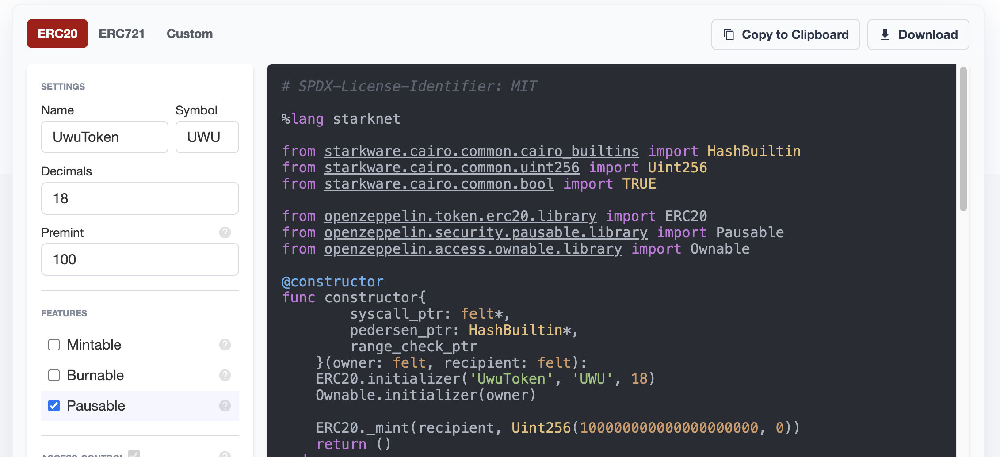

# Getting Started with Cairo (workshop) 👶🏻✨

Along with the slides ([🇬🇧eng](https://docs.google.com/presentation/d/1huYaO3NU8rJlqoQlyX8OhOgqMzq7P7B03_mEddPUJsE) / [🇪🇸spa](https://docs.google.com/presentation/d/1LUsjUU82w-Gs69UuBwrykYGtwCkf2RjzPT70J0FJAw8)), this repository works as an introductory guide to develop StarkNet smart contracts with the [Cairo](cairo-lang.org) programming language, the [OpenZeppelin Contracts for Cairo](https://github.com/OpenZeppelin/cairo-contracts/) library, and the [Nile](https://github.com/OpenZeppelin/nile/) development environment.

#### Resources:

- [Cairo by Example](https://perama-v.github.io/cairo/by-example/) (by Perama)
- [StarkNet documentation](https://starknet.io/docs/)
- [OpenZeppelin documentation](https://docs.openzeppelin.com/contracts-cairo)

## 1. Installation

### First time?

Before installing Cairo on your machine, you need to install `gmp`:

```bash
sudo apt install -y libgmp3-dev # linux
brew install gmp # mac
```

> If you have any troubles installing gmp on your Apple M1 computer, [here’s a list of potential solutions](https://github.com/OpenZeppelin/nile/issues/22).

### Set up your project

Create a directory for your project, then `cd` into it and create a Python virtual environment.

```bash
mkdir cairo-workshop
cd cairo-workshop
python3 -m venv env
source env/bin/activate
```

Install the [Nile](https://github.com/OpenZeppelin/nile) development environment and the [OpenZeppelin Contracts](https://github.com/OpenZeppelin/cairo-contracts/).

```bash
pip install cairo-lang cairo-nile openzeppelin-cairo-contracts
```

> Note that we're installing `nile v0.8.1b`. This is a beta release with additional functionality that will be very useful during this workshop.

Run `init` to kickstart a new project. Nile will create the project directory structure and install dependencies such as [the Cairo language](https://www.cairo-lang.org/docs/quickstart.html), a [local network](https://github.com/Shard-Labs/starknet-devnet/), and a [testing framework](https://docs.pytest.org/en/6.2.x/).

```bash
nile init
```

Now let's run a local StarkNet testing node so we can work locally, and leave it running for the rest of the steps:

```bash
nile node
```

## 2. Use a preset

Rename `contracts/contract.cairo` to `contracts/UwuToken.cairo` and replace its contents with:

```cairo
%lang starknet

from openzeppelin.token.erc20.presets.ERC20 import (
    constructor,
    name,
    symbol,
    totalSupply,
    decimals,
    balanceOf,
    allowance,
    transfer,
    transferFrom,
    approve,
    increaseAllowance,
    decreaseAllowance,
)
```


That's it! That's our ERC20 contract. What this does is to import the [ERC20 basic preset](https://github.com/OpenZeppelin/cairo-contracts/blob/ad399728e6fcd5956a4ed347fb5e8ee731d37ec4/src/openzeppelin/token/erc20/presets/ERC20.cairo) and re-exporting it. 

Let's try to compile it:

```
(env) ➜  nile compile

📁 Creating artifacts/abis to store compilation artifacts
🤖 Compiling all Cairo contracts in the contracts directory
🔨 Compiling contracts/UwuToken.cairo
✅ Done
```

Magic ✨

## 3. Deploy it (with a script!)

Let's now try to deploy our contract. Although we could simply use `nile deploy` like this:

```bash
nile deploy UwuToken <name> <symbol> <decimals> <initial_supply> <recipient> --alias uwu_token
```

Truth is that there's still some representation issues to overcome:
- strings (`name` and `symbol`) need to be converted to an integer representation first
- uint256 values such as `initial_supply` need to be represented by two `felt`s since they're just 252bits

To overcome this issues, it's easier to write a deployment script instead of using the CLI directly. Therefore we need to create a `scripts/` directory and create a `deploy.py` file in it:

> Note: you can find this script already written in this repo

```python
# scripts/deploy.py
from nile.utils import *

ALIAS = "uwu_token"
decimals = 18

def run(nre):
    account_a = nre.get_or_deploy_account("ACCOUNT_A")

    name = str_to_felt("UwuToken")
    symbol = str_to_felt("UWU")
    initial_supply = to_uint(to_decimals(1337))
    recipient = int(account_a.address, 16)

    arguments = [
        name,
        symbol,
        decimals,                         
        *initial_supply,
        recipient
    ]

    token_address, _ = nre.deploy("UwuToken", arguments, alias=ALIAS)
    print("UwuToken deployed at", token_address)

    supply = from_hex(nre.call("uwu_token", "totalSupply")[0])
    print("total supply:", from_decimals(supply))

    name = nre.call("uwu_token", "name")[0]
    print("token name:", felt_to_str(name))

    symbol = nre.call("uwu_token", "symbol")[0]
    print("token symbol:", felt_to_str(symbol))


def from_decimals(x):
    return x / (10 ** decimals)

def to_decimals(x):
    return x * (10 ** decimals)

def from_hex(x):
    return int(x, 16)
```

There's a few things to note in here:

- The script attempts to find or deploy an account controlled by the private key stored in the `ACCOUNT_A` environmental variable (see below).


Create a `.env` file to store your private keys so the script can find them:

```
ACCOUNT_A=207965718267142127099503064836527205057
ACCOUNT_B=671421270995030648365272050552079657182
```

That's it! We're ready to run:

```bash
nile run scripts/deploy.py
```

You should see something like this:

```
UwuToken deployed at 0x02cc100da2779fbf2d9f86281c3e7d459167deb372fb21c2e0e8527fdb0812ea
total supply: 1337.0
token name: UwuToken
token symbol: UWU
```

## 4. Interact with it

We can go one step further and write a script to transfer funds between accounts:

```python
# scripts/transfer.py
from nile.utils import *

ALIAS = "uwu_token"
decimals = 18

def run(nre):
    account_a = nre.get_or_deploy_account("ACCOUNT_A")
    account_b = nre.get_or_deploy_account("ACCOUNT_B")
    token_address, _ = nre.get_deployment(ALIAS)
    
    print_balance(nre, account_a.address, 'a')
    print_balance(nre, account_b.address, 'b')

    recipient = from_hex(account_b.address)
    amount = to_uint(to_decimals(0.5))

    print(f"transfer {from_decimals(from_uint(amount))} to {account_b.address}")
    account_a.send(token_address, 'transfer', [recipient, *amount], max_fee=0)

    print_balance(nre, account_a.address, 'a')
    print_balance(nre, account_b.address, 'b')


def get_balance(nre, address):
    balance = nre.call(ALIAS, "balanceOf", [from_hex(address)])[0]
    return from_hex(balance)

def print_balance(nre, address, alias):
    balance = get_balance(nre, address)
    print(f"balance {alias}", from_decimals(balance))

def from_decimals(x):
    return x / (10 ** decimals)

def to_decimals(x):
    return x * (10 ** decimals)

def from_hex(x):
    return int(x, 16)

```

And again, we run:

```bash
nile run scripts/transfer.py
```

## 5. Write a custom contract (i.e. extend a library)

Without inheritance or another language native extensibility system, we need to come up with our own rules to safely extend existing modules to e.g. build our own custom ERC20 based on a standard library one.

To do this we follow our own [Extensibility pattern](https://docs.openzeppelin.com/contracts-cairo/0.3.1/extensibility) (recommended reading), which extends `library` modules like this pausable `transfer` function:

```cairo
%lang starknet

from starkware.cairo.common.cairo_builtins import HashBuiltin
from starkware.cairo.common.uint256 import Uint256
from openzeppelin.security.pausable.library import Pausable
from openzeppelin.token.erc20.library import ERC20

(...)

@external
func transfer{
        syscall_ptr : felt*,
        pedersen_ptr : HashBuiltin*,
        range_check_ptr
    }(recipient: felt, amount: Uint256) -> (success: felt):
    Pausable.assert_not_paused()
    ERC20.transfer(recipient, amount)
    return (TRUE)
end
```

The main problem with this is that we need to manually re-export every function in order to make it available (`transfer`, `transferFrom`, `approve`, etc) even if we don't want to extend or make any changes to it.

### Luckily, we have [Wizard](https://wizard.openzeppelin.com/cairo)

With it, we can just add a `name`, `symbol`, premint amount and any features we want to our contract. In this example, I'll be creating the `UwuToken` and make it Pausable. Then I can copy to clipboard and paste it into `contracts/UwuTokenPausable.cairo`




### Deploy to a public network

To deploy to a public network like goerli or mainnet, contracts need to be declared first:

```bash
nile declare UwuToken --network goerli
```

Now we can run our deployment script against the `goerli` testnet:

```bash
nile run scripts/deploy.py --network goerli
```


## Extra mile

Develop your own custom contract using the [OpenZeppelin Contracts for Cairo](https://docs.openzeppelin.com/contracts-cairo) library!
